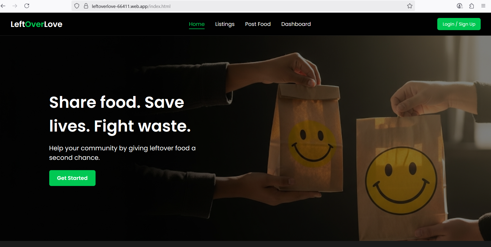
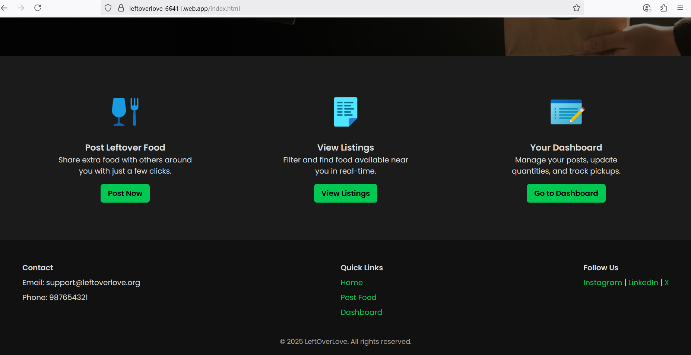
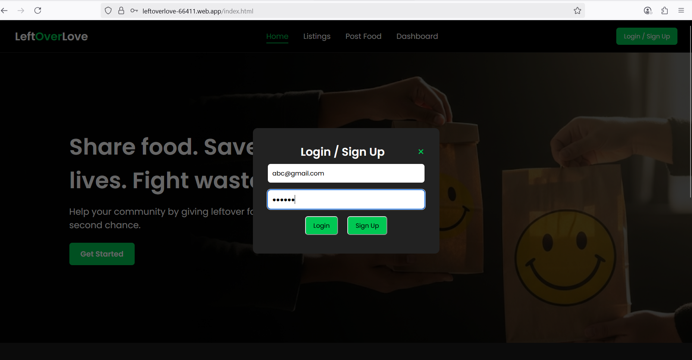
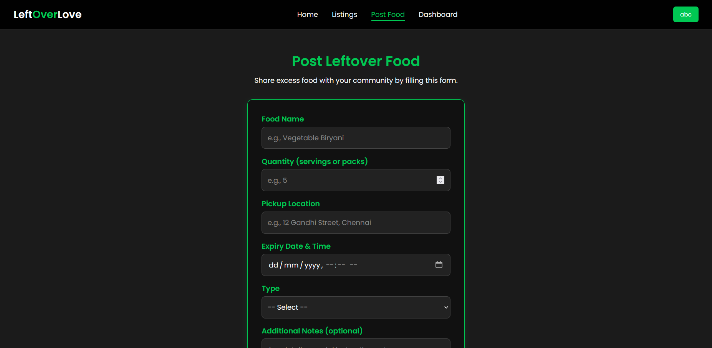
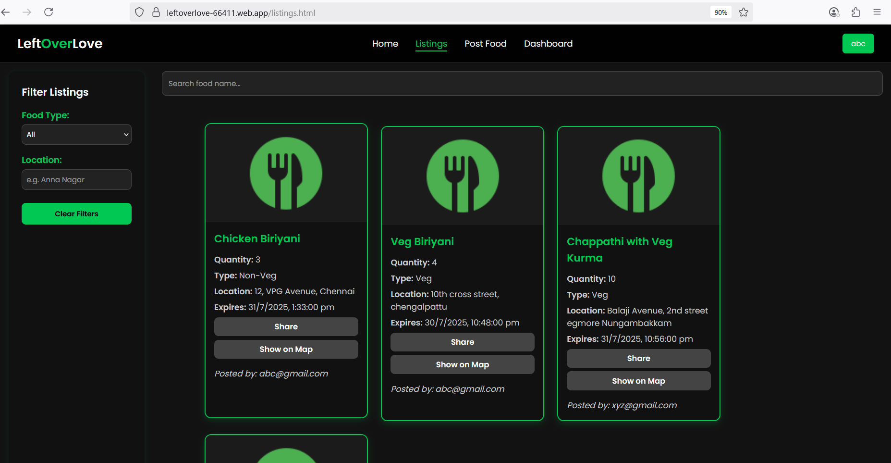
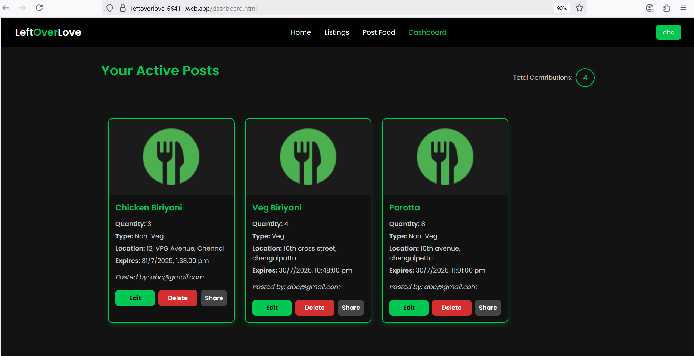
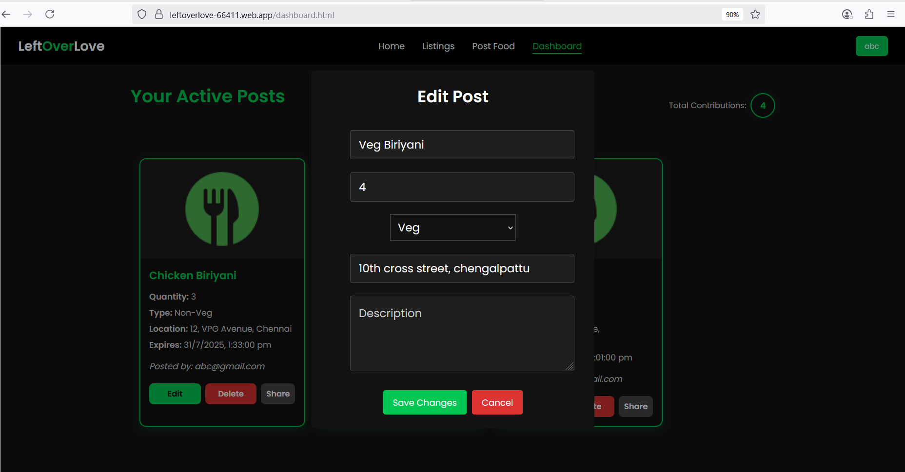
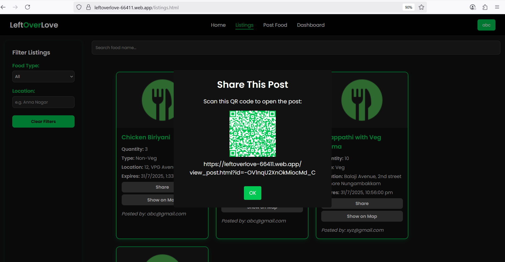

#  LeftOverLove – Local Food Share

LeftOverLove is a community-driven web platform that helps reduce food waste by allowing users to share surplus food with those in need. Built with Firebase, it offers a secure, real-time system where users can post, browse, filter, and share available food items.

---

## Project Overview

LeftOverLove bridges the gap between surplus food and people who can make use of it. The platform enables users to:
- Post details about excess food (type, quantity, expiry, location)
- View available food listings with smart filters
- Share posts via QR codes or copyable links
- Track and manage personal contributions via a dashboard
- View the exact location of food availability on a map

Only authenticated users can post food or access their personal dashboard, ensuring security and accountability.

---

## Technologies & Tools Used

- **Frontend**: 
  - React (Vite)
  - JavaScript (ES6+)
  - CSS3 (Responsive Design)
  - GSAP (Smooth Animations)

- **Backend & Hosting**:  
  - Firebase Authentication  
  - Firebase Realtime Database  
  - Firebase Hosting  

- **Other Tools & Libraries**:  
  - Maps (location view)  
  - QR Code for sharing  

---

##  Features Implemented

-  **User Authentication** using Firebase  
-  **Post Creation** with details like food name, type, quantity, expiry, location, and notes  
-  **Listings Page** to browse all active food posts  
-  **Smart Filters** to filter by food type, name, or location  
-  **QR Code Sharing** & Link Sharing for each post  
-  **Map Integration** to view exact location on Google Maps  
-  **User Dashboard** showing active posts of the user  
-  **Edit/Delete** posts before expiry from the dashboard  
-  **Contribution Tracker** displaying total posts made by the user  
-  **Mobile Responsive UI** for accessibility across devices

---
## Live Site

[Visit LeftOverLove](https://leftoverlove-66411.web.app/)

---

## Demo video

[Click here for demo video](https://drive.google.com/file/d/13NRQyGE8JnQiUl0sec5ZL6k57wm3RY4w/view?usp=drivesdk)

---

## How to Run Locally

Ensure you have **Node.js** installed on your machine.

```bash
# 1. Clone the repository
git clone https://github.com/srinithi0406/LeftOverLove.git

# 2. Navigate into the project folder
cd LeftOverLove

# 3. Install dependencies
npm install

# 4. Start the development server
npm run dev
```

## Screenshots of the web-app:











### Project by
- Srinithi A
Shiv Nadar University, Chennai

